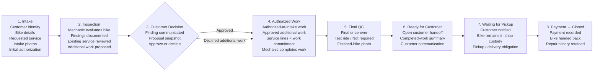
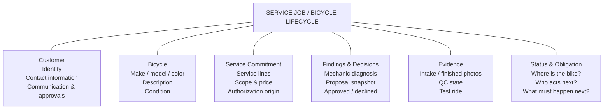

# Bucks County Bike Garage — Service Intake Product IA

**Purpose:** A designer-facing map of the service workflow. This describes the product and the mechanic/customer journey, not the technical architecture.

The primary object is a **customer-owned bicycle moving through an agreement about what work should be done, the work itself, and a safe handoff back to the customer.**

## Primary lifecycle

The decision stage does not imply that all work waits for customer approval. Work already authorized at intake can remain authorized; the decision applies to additional work proposed after inspection.

## Persistent product model

These are not sequential screens. They are information that should remain associated with the repair as the bicycle moves through the lifecycle.

## Information that persists across the journey

### Customer
- Name and contact information
- Communication history
- Approval/decision history

### Bicycle
- Make / model / color / description
- Intake condition
- Finished condition

### Service commitment
- Service lines
- Scope and price
- Authorization origin: authorized at intake or approved after intake

### Findings and decisions
- Mechanic diagnosis/finding
- Immutable proposed-service communication snapshot
- Customer approved / declined outcome

### Evidence
- Intake and finished photos
- Final QC state
- Test ride result
- Work/handoff record

### Status and obligation
At any point the system should make three things understandable:

1. **Where is the bicycle in the lifecycle?**
2. **Who owes the next action?**
3. **What must happen before the job advances?**

## Questions for design critique

- Does this lifecycle match the mechanic's mental model, or does it expose too much process?
- What information should remain continuously visible while moving through stages?
- Are **Finding**, **Customer Decision**, and **Service Line** understandable product concepts, or are implementation concepts leaking into the UI?
- Should the interface primarily orient around the physical bike, the customer, or the service job?
- Which transitions deserve explicit confirmation and which should feel almost invisible?
- When a mechanic reopens a bike after several days, what should be immediately obvious?
- Where can the workflow reduce cognitive load without hiding important authorization or safety information?

## Design intent

This map is intentionally not a proposed screen layout. The existing application already implements the workflow; this artifact is meant to make the product model easy to critique before over-investing in visual implementation.

The working application and implementation repository remain private. This public artifact contains no customer data or private operational configuration.
